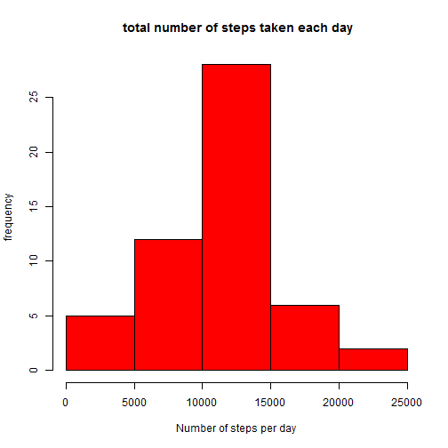
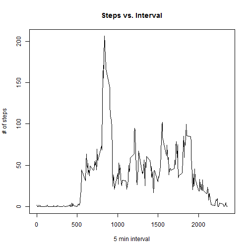
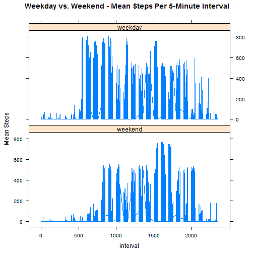

## Loading and preprocessing the data

```r
mydata <- read.csv("activity.csv", header = TRUE, sep = ",")
mydata$date = as.Date(mydata$date, "%Y-%m-%d")
```

## What is mean total number of steps taken per day?

Make a histogram of the total number of steps taken each day


```r
mydata <- na.omit(mydata)
sum1 <- tapply(mydata$steps,mydata$date,sum)
sum1 <- data.frame(date=names(sum1), steps=sum1)
hist(sum1$steps,xlab = "Number of steps per day", ylab = "frequency", main = " total number of steps taken each day",col ="red")
```

 

Median and Median of total number of steps taken per day:


```r
print(summary(sum1))
```

```
##          date        steps      
##  2012-10-02: 1   Min.   :   41  
##  2012-10-03: 1   1st Qu.: 8841  
##  2012-10-04: 1   Median :10765  
##  2012-10-05: 1   Mean   :10766  
##  2012-10-06: 1   3rd Qu.:13294  
##  2012-10-07: 1   Max.   :21194  
##  (Other)   :47
```

## What is the average daily activity pattern?

Time series plot of the 5-minute interval (x-axis) and the average number of steps taken, averaged across all days (y-axis)


```r
mean1 <- aggregate(steps ~ interval, mydata, FUN = mean)
plot(mean1$interval, mean1$steps, type='l',main = ("Steps vs. Interval"), ylab = "# of steps", xlab = "5 min interval")
```

 

Interval with the maximum number of steps:

```r
print(mean1$interval[which(mean1$steps== max(mean1$steps))])
```

```
## [1] 835
```

## Imputing missing values

Number of missing data:

```r
print(sum(is.na(mydata)))
```

```
## [1] 0
```

Dataset after filling in all of the missing values in the dataset

```r
steps_interval <- aggregate(steps ~ interval, data=mydata, FUN=mean)
mydata <- merge(mydata, steps_interval, by="interval", suffixes=c("",".y"))
nas <- is.na(mydata$steps)
mydata$steps[nas] <- mydata$steps.y[nas]
mydata <- mydata[,c(1:3)]
```

Histogram of the total number of steps taken each day

```r
steps_date <- aggregate(steps ~ date, data=mydata, FUN=sum)
hist(steps_date$steps,xlab = "Number of steps per day", ylab = "frequency", main = " total number of steps taken each day",col ="red")
```

 

Median and Median of total number of steps taken per day:

```r
print(summary(steps_date))
```

```
##       date                steps      
##  Min.   :2012-10-02   Min.   :   41  
##  1st Qu.:2012-10-16   1st Qu.: 8841  
##  Median :2012-10-29   Median :10765  
##  Mean   :2012-10-30   Mean   :10766  
##  3rd Qu.:2012-11-16   3rd Qu.:13294  
##  Max.   :2012-11-29   Max.   :21194
```

## Differences in activity patterns between weekdays and weekends?

Factor variable in the dataset with two levels - "weekday" and "weekend"

```r
weekdays1 <- c('Monday', 'Tuesday', 'Wednesday', 'Thursday', 'Friday')
mydata$day <- factor((weekdays(mydata$date) %in% weekdays1), 
                   levels=c(FALSE, TRUE), labels=c('weekend', 'weekday'))
```

Panel plot containing a time series plot of the 5-minute interval (x-axis) and the average number of steps taken


```r
library(lattice)
print(xyplot(steps ~ interval | day, 
       data=mydata, type="l", layout=c(1,2),
       ylab = "Mean Steps", main="Weekday vs. Weekend - Mean Steps Per 5-Minute Interval"))
```

 
